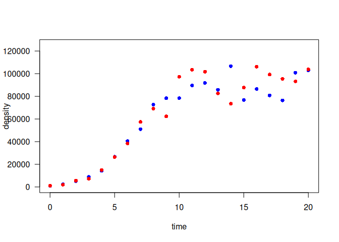
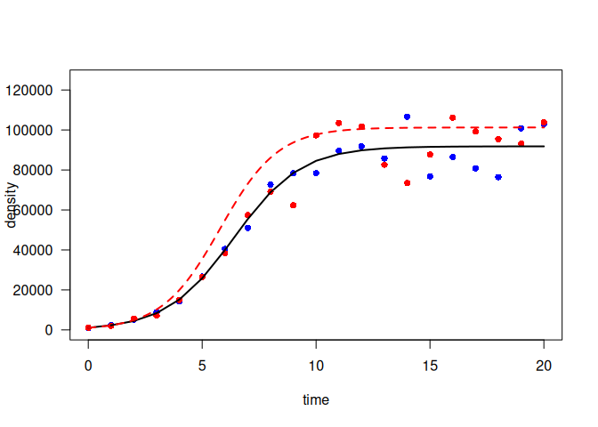

dynasymfitr: Fitting dynamically simulated ecological population models
to laboratory data
================

<!-- README.md is generated from README.Rmd. Please edit that file -->

## Overview

<!-- badges: start -->

<!-- badges: end -->

The goal of `dynasymfitr` is to provide a set of functions to analyze
laboratory species interaction experiments in a way that the parameter
estimates can be seamlessly integrated into theoretical/computational
eco-evo projects. `dynasymfitr` will be developed within the DFG-funded
research unit 5726, [DynaSym](https://www.dynasym.uni-konstanz.de/), but
is not limited to it.

Estimating density-dependent species interactions is not trivial. The
possibly most prominent example is the density-dependent feeding rate,
also known as functional response (Holling 1959). Feeding is a temporal
process, which requires that the functional response model be modeled as
a differential equation describing the decay of the resource over time
(Rosenbaum and Rall 2018). While a so-called analytical solution exists
for the classical hyperbolic type II functional response (Royama 1971;
Rogers 1972; Bolker 2008), the differential equations of other
functional response types need to be solved numerically while being
fitted to data (Rosenbaum and Rall 2018) to avoid biases in the
parameter evaluation. In addition to the above-mentioned problem, if
using small organisms such as algae as resources and ciliates as
consumers, even in short-term experiments these critters may grow or
decline in population size (i.e., the numerical response) due to death
and reproduction. This issue would add even more bias to the estimated
parameters. However, by simulating the dynamics of resources and
consumers explicitly, these biases can be corrected (Rosenbaum and Rall
2018). [DynaSym](https://www.dynasym.uni-konstanz.de/) researchers will
predominantly work in aquatic planktonic environments to detect the
strength and sign of symbiotic species interactions (Becks, Gaedke, and
Klauschies 2025). Therefore, we will not only add models describing
species interactions as mentioned above, but also widely used nutrient
uptake models (Tilman 1977; Huisman and Weissing 1999; Brose 2008; Zhang
and Becks 2024).

Please note that this package is under development, and we will also add
more information to the README in the future.

## License

This package is published under the [**GNU General Public License
3**](https://www.gnu.org/licenses/gpl-3.0.html).

## How to cite

If you use this R-package, please cite it:

Rall, B.C. (2025): dynasymfitr: Fitting dynamically simulated ecological
population models to laboratory data. Zenodo.
<https://doi.org/10.5281/zenodo.15856656>.

Please cite also the underlying method:

Rosenbaum, B. and Rall, B.C. (2018): Fitting Functional Responses:
Direct parameter estimation by simulating differential equations.
Methods in Ecology and Evolution 9 (10): 2076–90.
<https://doi.org/10.1111/2041-210X.13039>.

### Cite specific versions:

Rall, B.C. (2025): dynasymfitr: Fitting dynamically simulated ecological
population models to laboratory data (v0.0.0.9001). Zenodo.
<https://doi.org/10.5281/zenodo.15863205>. Rall, B.C. (2025):
dynasymfitr: Fitting dynamically simulated ecological population models
to laboratory data (v0.0.0.9000). Zenodo.
<https://doi.org/10.5281/zenodo.15856657>.

## Installation

### Install current development version

You can install the latest development version of dynasymfitr from
[GitHub](https://github.com/) with:

``` r
# install.packages("devtools")
devtools::install_github("b-c-r/dynasymfitr@*release") # current release
```

### Install specific versions:

I f you want to install a former version, you may add the specific
version number, e.g. like:

``` r
devtools::install_github("b-c-r/dynasymfitr@v0.0.0.9000") # version 0.0.0.9000 (initial release)
```

But see [this
thread](https://stackoverflow.com/questions/40179493/r-how-can-i-install-a-specific-release-by-install-github)
how to install specific version and even specific commits.

## Examples

### Fitting the generalized functional response

First, load the `dynasymfitr` and the `bbmle` package:

``` r
library("dynasymfitr")
# install.packages("bbmle")
library("bbmle")
```

Transfer the data to an object with a shorter name:

``` r
fr_data <- data_vucic_pestic_et_al_2010_j_anim_ecol
```

Fit the model to the data:

``` r
fit <- bbmle::mle2(
  minuslogl = calc_gen_fr_nll,
  start = list(
    f_max_log10  = log10(max(fr_data$n_eaten)),
    n_half_log10 = log10(mean(fr_data$n_initial)),
    q = 0.2
  ),
  
  data = list(
    n_eaten = fr_data$n_eaten,
    n_initial = fr_data$n_initial,
    p = rep(1, nrow(fr_data)),
    t_end = rep(1, nrow(fr_data))
  ),
  control = list(reltol = 1e-12, maxit = 1000)
)
```

See the summary table:

``` r
bbmle::summary(fit)
#> Maximum likelihood estimation
#> 
#> Call:
#> bbmle::mle2(minuslogl = calc_gen_fr_nll, start = list(f_max_log10 = log10(max(fr_data$n_eaten)), 
#>     n_half_log10 = log10(mean(fr_data$n_initial)), q = 0.2), 
#>     data = list(n_eaten = fr_data$n_eaten, n_initial = fr_data$n_initial, 
#>         p = rep(1, nrow(fr_data)), t_end = rep(1, nrow(fr_data))), 
#>     control = list(reltol = 1e-12, maxit = 1000))
#> 
#> Coefficients:
#>              Estimate Std. Error z value     Pr(z)    
#> f_max_log10  1.399850   0.038288 36.5607 < 2.2e-16 ***
#> n_half_log10 1.471545   0.083398 17.6449 < 2.2e-16 ***
#> q            0.597590   0.196908  3.0349  0.002406 ** 
#> ---
#> Signif. codes:  0 '***' 0.001 '**' 0.01 '*' 0.05 '.' 0.1 ' ' 1
#> 
#> -2 log L: 307.7785
```

Simulate the best fit:

``` r
out <- simulate_gen_fr(
 n_initial = 0:1000,                 # vector of initial prey densities
 p = rep(1,1001),                    # fixed predator density
 t_end = rep(1,1001),                # fixed end time of the experiment
 f_max = 10^bbmle::coef(fit)[[1]],   # maximum feeding rate
 n_half = 10^bbmle::coef(fit)[[2]],  # half saturation density
 q = bbmle::coef(fit)[[3]]           # shape parameter (1 = s-shaped)
)
```

Create the regression plot:

``` r
# plot results
plot(
 fr_data$n_initial,
 fr_data$n_eaten,
 ylab = "number of prey eaten",
 xlab = "initial prey density"
)
lines(
 out[,1],
 out[,2]
)
```


### Fitting a logistic growth curve assuming pulsed exchange of media

A classical method to design time-series experiments in aquatic systems
is to use chemostats with a constant influx of fresh media and outflux
of the media including the organisms in the experiments. From this
outflux, the researcher can estimate the current density of the
organisms. Alternatively, a fraction of the media is replaced in more or
less equally time intervals. This “pulsed” sampling are comparable to
the chemostats, but the organisms do not have a continuous disturbance,
but reoccurring disturbances events. You analyse such data in the
following way. First, we simulate data:

``` r
library("bbmle") # for fitting procedure
library("dynasymfitr")

set.seed(667)

data_log_growth <- simulate_logistic_growth_pulsed(
  t_pulse = 0:20,                           # time at which media is exchanged or disturbance happens
  fraction_exchanged = c(0, rep(0.1,20)),   # the fraction of media replaced (or the strength of disturbance)
  n_initial = 1000,                         # the initial resource density
  r = .8,                                   # the intrinsic growth rate
  K = 100000                                # the carrying capacity
)

# create a second time series:
data_log_growth <- rbind(data_log_growth, data_log_growth)
data_log_growth$ts_id <- c(rep("A",21), rep("B",21))
data_log_growth$frac_replaced <- c(0, rep(0.1,20), 0, rep(0.1,20))

# add statistical noise (poisson distributed)
data_log_growth$n_noise <- 10^(rnorm(n = length(data_log_growth$n), mean = log10(data_log_growth$n), sd = .05 ))
```

This example assumes that the time series data has very high densities,
e.g. as often seen with unicells, such as algae, ciliates, or bacteria.
The data can be counts, but also, to keep the values smaller, floating
numbers, e.g. 12.3 individuals per microliter. Notably, this approach
doesn’t allow for “0” in the density data! Most times, the density data
is log-normal distributed, i.e. low variation if the density is low,
high variation in the data if the densities are high. We simulate this
with the last code line in the code block above.

Our simulated laboratory data looks quite reasonable:

``` r
# plot the time series
par(las=1)
plot(
  data_log_growth$t,
  data_log_growth$n_noise,
  ylim = c(0, 125000),
  type = "n",
  pch = 16,
  xlab = "time",
  ylab = "density"
)
points(
  data_log_growth$t[data_log_growth$ts_id == "A"],
  data_log_growth$n_noise[data_log_growth$ts_id == "A"],
  pch = 16,
  col = "blue"
)
points(
  data_log_growth$t[data_log_growth$ts_id == "B"],
  data_log_growth$n_noise[data_log_growth$ts_id == "B"],
  pch = 16,
  col = "red"
)
```



You see two different time series, but the initial density is
approximately the same. In the current version of the package, this
requirnment must be fulfilled. I aim at making this more flexible later.

### Fit the time series

Like above for the generalized functional response, we use the great
`bbmle` package to fit the data:

``` r
fit_lnorm <- bbmle::mle2(
  minuslogl = calc_logistic_growth_nll_lnorm,
  start = list(
    param_r_log10 = log10(0.8),
    param_K_log10 = log10(100000),
    param_n_initial_log10 = log10(1000),
    param_sd_log10 = log10(0.1)
  ),
  data = list(
    data_time = data_log_growth$t,
    data_density = data_log_growth$n_noise,
    data_frac_exchanged = data_log_growth$frac_replaced,
    data_ts_id = data_log_growth$ts_id
    ),
  fixed = list(
    setting_t_length = 1000
    ),
  control = list(reltol = 1e-12, maxit = 1000)
)
```

When looking at the results, you may note that the values look strange,
this is caused by the fact that the parameters where fitted on a log10
scale, to increase fitting speed and stability. Moreove it prevents the
fitting algorithm to choose negative values, like e.g. a negative growth
rate or carrying capacity.

``` r
bbmle::summary(fit_lnorm)
#> Maximum likelihood estimation
#> 
#> Call:
#> bbmle::mle2(minuslogl = calc_logistic_growth_nll_lnorm, start = list(param_r_log10 = log10(0.8), 
#>     param_K_log10 = log10(1e+05), param_n_initial_log10 = log10(1000), 
#>     param_sd_log10 = log10(0.1)), fixed = list(setting_t_length = 1000), 
#>     data = list(data_time = data_log_growth$t, data_density = data_log_growth$n_noise, 
#>         data_frac_exchanged = data_log_growth$frac_replaced, 
#>         data_ts_id = data_log_growth$ts_id), control = list(reltol = 1e-12, 
#>         maxit = 1000))
#> 
#> Coefficients:
#>                         Estimate Std. Error z value     Pr(z)    
#> param_r_log10         -0.1052940  0.0095654 -11.008 < 2.2e-16 ***
#> param_K_log10          5.0054617  0.0109603 456.691 < 2.2e-16 ***
#> param_sd_log10        -1.3133966  0.0473856 -27.717 < 2.2e-16 ***
#> param_n_initial_log10  3.0287312  0.0238133 127.187 < 2.2e-16 ***
#> ---
#> Signif. codes:  0 '***' 0.001 '**' 0.01 '*' 0.05 '.' 0.1 ' ' 1
#> 
#> -2 log L: -134.8429
```

Back-transforming the parameters reveals that the fit ist quite good:

``` r
# growth rate simulated value (0.8) is well-matched by fit:
10^bbmle::summary(fit_lnorm)@coef[1]
#> [1] 0.7847042

# carrying capacity simulated value (100000) is well-matched by fit:
10^bbmle::summary(fit_lnorm)@coef[2]
#> [1] 101265.6

# standard distribution of data (0.05) is well-matched by fit:
10^bbmle::summary(fit_lnorm)@coef[3]
#> [1] 0.04859633

# initial start value of data (1000) is well-matched by fit:
10^bbmle::summary(fit_lnorm)@coef[4]
#> [1] 1068.393
```

Let us plot the data with the regression line (black line) and a line
representing a simulation in which the researcher would not have
disturbed the system (red dashed line):



You can find the code either in the according help-file or the
README.rmd.

## Funding Information

- Björn C. Rall gratefully acknowledges the funding by the [**German
  Science Foundation (DFG) to the Research Unit DynaSym (FOR
  5726)**](https://gepris.dfg.de/gepris/projekt/528028597).

## References

<div id="refs" class="references csl-bib-body hanging-indent"
entry-spacing="0">

<div id="ref-BecksEtAl2025EmergentFeedbackSymbiosis" class="csl-entry">

Becks, Lutz, Ursula Gaedke, and Toni Klauschies. 2025. “Emergent
Feedback Between Symbiosis Form and Population Dynamics.” *Trends in
Ecology & Evolution* 0 (0): 0.
<https://doi.org/10.1016/j.tree.2025.02.006>.

</div>

<div id="ref-Bolker2008EcologicalModelsData" class="csl-entry">

Bolker, Benjamin M. 2008. *Ecological Models and Data in R*. Princeton,
New Jersey: Princeton University Press.

</div>

<div id="ref-Brose2008ComplexFoodWebs" class="csl-entry">

Brose, Ulrich. 2008. “Complex Food Webs Prevent Competitive Exclusion
Among Producer Species.” *Proceedings of the Royal Society B: Biological
Sciences* 275 (1650): 2507–14. <https://doi.org/10.1098/rspb.2008.0718>.

</div>

<div id="ref-Holling1959CharacteristicsSimpleTypes" class="csl-entry">

Holling, C. S. 1959. “Some Characteristics of Simple Types of Predation
and Parasitism.” *The Canadian Entomologist* 91 (7): 385–98.
<https://doi.org/10.4039/Ent91385-7>.

</div>

<div id="ref-HuismanWeissing1999BiodiversityPlanktonSpecies"
class="csl-entry">

Huisman, Jef, and Franz J. Weissing. 1999. “Biodiversity of Plankton by
Species Oscillations and Chaos.” *Nature* 402 (6760): 407–10.
<https://doi.org/10.1038/46540>.

</div>

<div id="ref-Rogers1972RandomSearchInsect" class="csl-entry">

Rogers, David. 1972. “Random Search and Insect Population Models.” *The
Journal of Animal Ecology* 41 (2): 369–83.
<https://doi.org/10.2307/3474>.

</div>

<div id="ref-RosenbaumRall2018FittingFunctionalResponses"
class="csl-entry">

Rosenbaum, Benjamin, and Björn Christian Rall. 2018. “Fitting Functional
Responses: Direct Parameter Estimation by Simulating Differential
Equations.” *Methods in Ecology and Evolution* 9 (10): 2076–90.
<https://doi.org/10.1111/2041-210X.13039>.

</div>

<div id="ref-Royama1971ComparativeStudyModels" class="csl-entry">

Royama, T. 1971. “A Comparative Study of Models for Predation and
Parasitism.” *Researches on Population Ecology* 13 (1): 1–91.
<https://doi.org/10.1007/BF02511547>.

</div>

<div id="ref-Tilman1977ResourceCompetitionPlankton" class="csl-entry">

Tilman, David. 1977. “Resource Competition Between Plankton Algae: An
Experimental and Theoretical Approach.” *Ecology* 58 (2): 338–48.
<https://doi.org/10.2307/1935608>.

</div>

<div id="ref-ZhangBecks2024MechanisticRulesSpecies" class="csl-entry">

Zhang, Zhijie, and Lutz Becks. 2024. “The Mechanistic Rules for Species
Coexistence.” bioRxiv. <https://doi.org/10.1101/2024.05.07.592948>.

</div>

</div>
